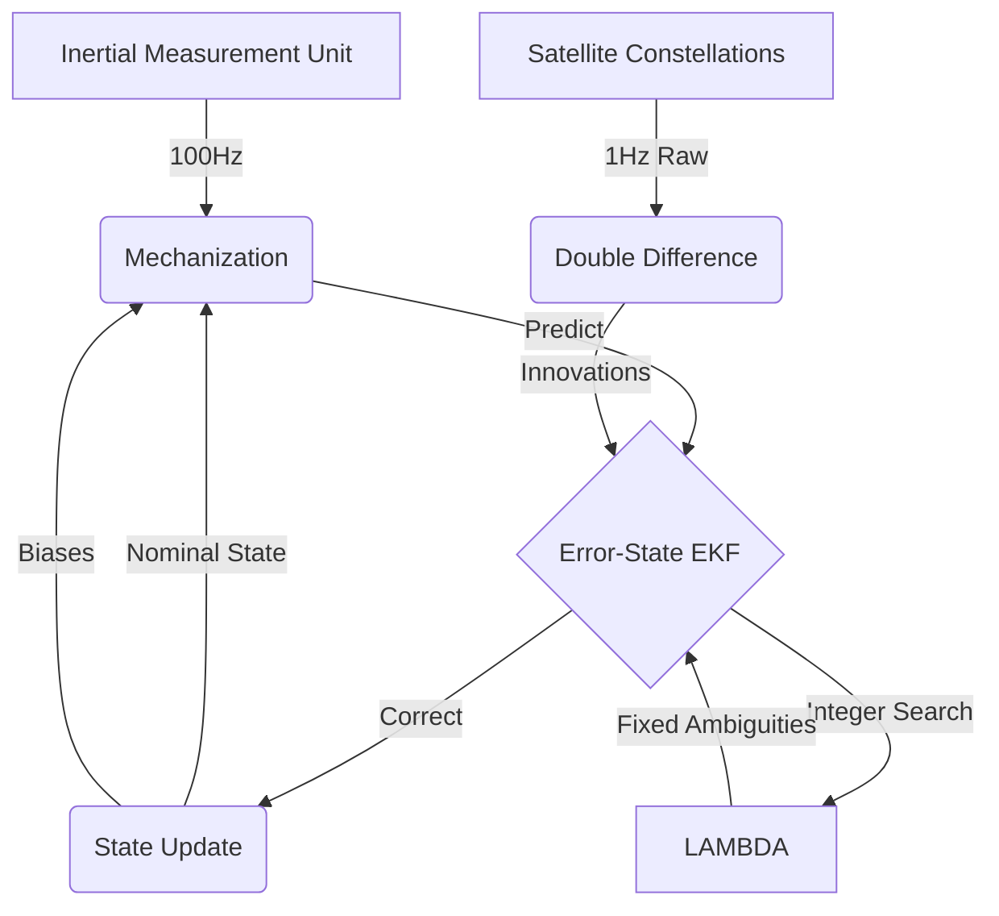

# Architecture

This document outlines the high-level architecture and mathematical models utilized by the Gneiss navigation engine.

## Design Principles

The engine is built around three primary design choices:
1. **Raw Observation Fusion**: Gneiss fuses raw satellite measurements (pseudorange, carrier phase, and Doppler) directly into an Extended Kalman Filter (EKF), rather than integrating pre-calculated position solutions from a receiver.
2. **First-Principles Kinematics**: The inertial mechanization process strictly models Earth rotation (Coriolis effect) and uses WGS84 gravity models to predict physical motion.
3. **Statistical Validation**: Integer ambiguity resolution relies on empirical statistical testing to maintain a bounded false-fix probability.

## Data Flow

The engine integrates high-rate inertial measurements with low-rate satellite observations:



## Extended Kalman Filter State Vector

The primary filter is an 18-state Error-State Kalman Filter. Instead of estimating absolute position and velocity directly, the filter tracks the *error* (drift) accumulated by the inertial mechanization process.

```text
State Vector Breakdown:
[ 0..3  ] Position Error (Earth-Centered, Earth-Fixed frame)
[ 3..6  ] Velocity Error (Earth-Centered, Earth-Fixed frame)
[ 6..9  ] Attitude Error (Small-angle rotation approximation)
[ 9..12 ] Accelerometer Bias (Body frame)
[ 12..15] Gyroscope Bias (Body frame)
[ 15..16] Receiver Clock Bias
[ 16..17] Receiver Clock Drift
[ 17..18] Zenith Wet Delay (Troposphere)
```

By tracking errors, the integration math remains largely linear and avoids truncation issues in floating-point representations of large global coordinates.


## Precise Point Positioning (PPP) Modeling

For global standalone accuracy, Gneiss incorporates advanced physical models to eliminate errors that RTK typically cancels out via a local base station:
- **Ionosphere-Free (IF) Combinations**: Dual-frequency code and phase measurements are linearly combined to eliminate first-order ionospheric delay. Dynamic variance estimators automatically scale the IF noise inflation based on frequency separation.
- **Geophysical Tides**: Corrects Earth-Centered, Earth-Fixed (ECEF) coordinates dynamically for Solid Earth Tides (SET) based on lunisolar gravitational pull using IERS conventions.
- **Satellite Phase Wind-Up**: Corrects fractional carrier phase cycles induced by the geometric rotation of the emitting satellite antennas as they orbit and maintain solar panel alignment.
- **Clock Jump Detection**: Detects and isolates 1ms+ clock jump resets, shifting both the state and phase ambiguities to prevent EKF covariance tearing.

## Tightly-Coupled Update

Satellite range residuals are projected into the EKF using a geometric observation matrix ($H$). To fuse attitude (heading/pitch/roll) directly from satellite data, Gneiss uses a tightly-coupled approach that projects the lever arm (the physical offset between the IMU and GNSS antenna) into the measurement domain.

The Jacobian mapping attitude errors to range residuals is defined as:
$$ \mathbf{H}_{att} = [ (\mathbf{R}_b^e \mathbf{l}^b) \times (\mathbf{e}_{ref} - \mathbf{e}_{sat}) ]^T $$

This allows the filter to observe and correct inertial heading errors using only GNSS range data.

## Ambiguity Resolution (LAMBDA)

Carrier-phase measurements provide millimeter-level precision but contain an unknown integer number of wavelengths (the ambiguity). Resolving these integers is critical for RTK accuracy.

Gneiss implements the Least-squares AMBiguity Decorrelation Adjustment (LAMBDA) method. The search space for these integers is highly correlated (an elongated hyper-ellipsoid). LAMBDA applies a $Z$-transformation (based on $UDU^T$ decomposition) to orthogonalize the search space, allowing an efficient depth-first tree search for the optimal integer candidates.

### Fixed Failure-Rate Ratio Test (FFRT)
Once integer candidates are generated, the engine validates them using the Fixed Failure-Rate Ratio Test (FFRT). Unlike legacy ratio tests that use an arbitrary scalar threshold (e.g., a static `3.0`), FFRT computes the threshold dynamically based on the requested failure rate $P_f$, the number of ambiguities $n$, and the stochastic properties of the float covariance matrix. This statistically bounds the false-fix probability, ensuring that when the engine locks into an RTK "Fixed" mode, it has mathematically rigorous confidence in the solution.

## Adaptive Estimation

To handle dynamic noise environments (e.g., urban canyons), Gneiss scales sensor variances dynamically rather than relying on fixed configurations:

1. **MAD RAIM (Median Absolute Deviation):** For initial Single Point Positioning (SPP), Gneiss calculates the median residual across all visible satellites. It dynamically rejects outliers based on deviations from this median, which prevents valid satellites from being dropped during temporary periods of high overall variance.
2. **Innovation-based Adaptive Estimation (IAE):** The EKF tracks a moving average of the filter innovations ($Z_{actual} - Z_{predicted}$). If the empirical variance exceeds the theoretical noise models (derived from SNR and elevation angles), the filter automatically de-weights those specific satellites.
3. **Rauch-Tung-Striebel (RTS) Smoothing:** During post-processing, the engine saves the prediction covariance matrices and transition matrices from the forward EKF loop. The RTS backward sweep then propagates these error states in reverse time, significantly improving accuracy during signal outages.
