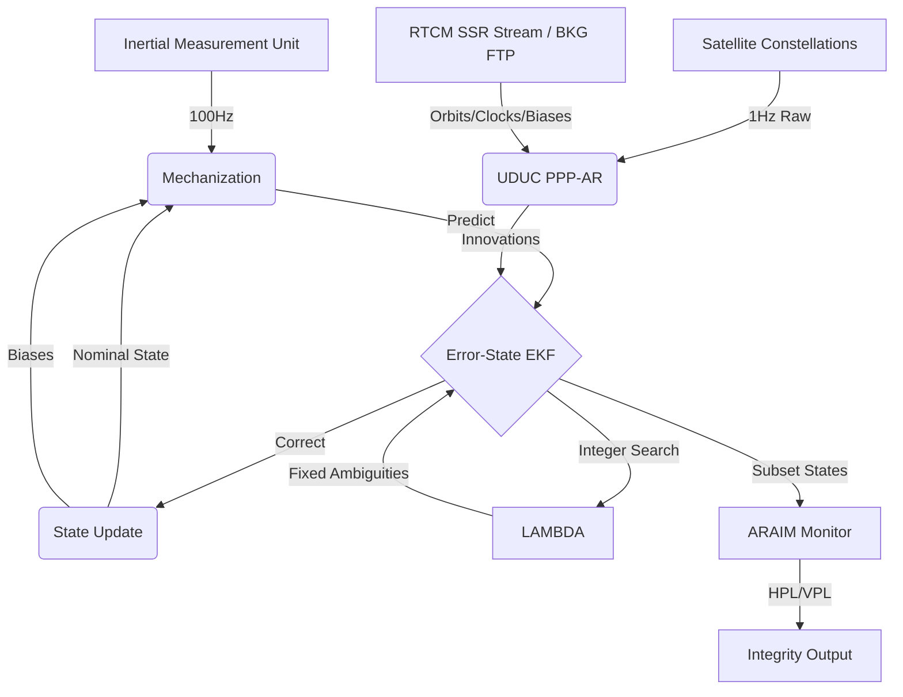
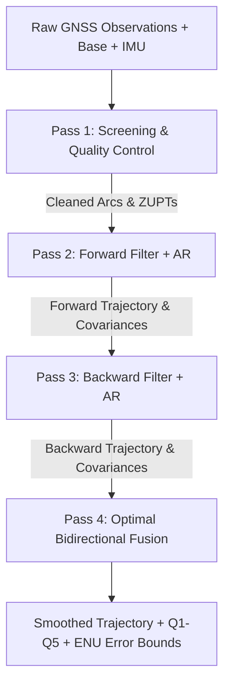

# Architecture

This document outlines the high-level architecture and mathematical models utilized by the Gneiss navigation engine.

## Design Principles

The engine is built around three primary design choices:
1. **Raw Observation Fusion**: Gneiss fuses raw satellite measurements (pseudorange, carrier phase, and Doppler) directly into an Extended Kalman Filter (EKF), rather than integrating pre-calculated position solutions from a receiver.
2. **First-Principles Kinematics**: The inertial mechanization process strictly models Earth rotation (Coriolis effect) and uses WGS84 gravity models to predict physical motion.
3. **Statistical Validation**: Integer ambiguity resolution relies on empirical statistical testing to maintain a bounded false-fix probability.

## Data Flow

The engine integrates high-rate inertial measurements with low-rate satellite observations:



## Extended Kalman Filter State Vector

The primary filter is an 18-state Error-State Kalman Filter. Instead of estimating absolute position and velocity directly, the filter tracks the *error* (drift) accumulated by the inertial mechanization process.

```text
State Vector Breakdown:
[ 0..3  ] Position Error (Earth-Centered, Earth-Fixed frame)
[ 3..6  ] Velocity Error (Earth-Centered, Earth-Fixed frame)
[ 6..9  ] Attitude Error (Small-angle rotation approximation)
[ 9..12 ] Accelerometer Bias (Body frame)
[ 12..15] Gyroscope Bias (Body frame)
[ 15..16] Receiver Clock Bias
[ 16..17] Receiver Clock Drift
[ 17..18] Zenith Wet Delay (Troposphere)
```

By tracking errors, the integration math remains largely linear and avoids truncation issues in floating-point representations of large global coordinates.


## Precise Point Positioning (PPP) Modeling

For global standalone accuracy, Gneiss incorporates advanced physical models to eliminate errors that RTK typically cancels out via a local base station:
- **Ionosphere-Free (IF) Combinations**: Dual-frequency code and phase measurements are linearly combined to eliminate first-order ionospheric delay. Dynamic variance estimators automatically scale the IF noise inflation based on frequency separation.
- **Geophysical Tides**: Corrects Earth-Centered, Earth-Fixed (ECEF) coordinates dynamically for Solid Earth Tides (SET) based on lunisolar gravitational pull using IERS conventions.
- **Satellite Phase Wind-Up**: Corrects fractional carrier phase cycles induced by the geometric rotation of the emitting satellite antennas as they orbit and maintain solar panel alignment.
- **Clock Jump Detection**: Detects and isolates 1ms+ clock jump resets, shifting both the state and phase ambiguities to prevent EKF covariance tearing.

## Tightly-Coupled Update

Satellite range residuals are projected into the EKF using a geometric observation matrix ($H$). To fuse attitude (heading/pitch/roll) directly from satellite data, Gneiss uses a tightly-coupled approach that projects the lever arm (the physical offset between the IMU and GNSS antenna) into the measurement domain.

The Jacobian mapping attitude errors to range residuals is defined as:
$$ \mathbf{H}_{att} = [ (\mathbf{R}_b^e \mathbf{l}^b) \times (\mathbf{e}_{ref} - \mathbf{e}_{sat}) ]^T $$

This allows the filter to observe and correct inertial heading errors using only GNSS range data.

## Ambiguity Resolution (LAMBDA)

Carrier-phase measurements provide millimeter-level precision but contain an unknown integer number of wavelengths (the ambiguity). Resolving these integers is critical for RTK accuracy.

Gneiss implements the Least-squares AMBiguity Decorrelation Adjustment (LAMBDA) method. The search space for these integers is highly correlated (an elongated hyper-ellipsoid). LAMBDA applies a $Z$-transformation (based on $UDU^T$ decomposition) to orthogonalize the search space, allowing an efficient depth-first tree search for the optimal integer candidates.

### Fixed Failure-Rate Ratio Test (FFRT)
Once integer candidates are generated, the engine validates them using the Fixed Failure-Rate Ratio Test (FFRT). Unlike legacy ratio tests that use an arbitrary scalar threshold (e.g., a static `3.0`), FFRT computes the threshold dynamically based on the requested failure rate $P_f$, the number of ambiguities $n$, and the stochastic properties of the float covariance matrix. This statistically bounds the false-fix probability, ensuring that when the engine locks into an RTK "Fixed" mode, it has mathematically rigorous confidence in the solution.

## Adaptive Estimation

To handle dynamic noise environments (e.g., urban canyons), Gneiss scales sensor variances dynamically rather than relying on fixed configurations:

1. **MAD RAIM (Median Absolute Deviation):** For initial Single Point Positioning (SPP), Gneiss calculates the median residual across all visible satellites. It dynamically rejects outliers based on deviations from this median, which prevents valid satellites from being dropped during temporary periods of high overall variance.
2. **Innovation-based Adaptive Estimation (IAE):** The EKF tracks a moving average of the filter innovations ($Z_{actual} - Z_{predicted}$). If the empirical variance exceeds the theoretical noise models (derived from SNR and elevation angles), the filter automatically de-weights those specific satellites.
3. **Rauch-Tung-Striebel (RTS) Smoothing:** During post-processing, the engine saves the prediction covariance matrices and transition matrices from the forward EKF loop. The RTS backward sweep then propagates these error states in reverse time, significantly improving accuracy during signal outages.

## Integrity Monitoring (ARAIM)

Gneiss implements an Advanced Receiver Autonomous Integrity Monitoring (ARAIM) module using the **Solution Separation** methodology. This enables the engine to guarantee strict integrity limits for autonomous driving or aviation workloads.
The primary filter runs alongside parallel sub-filters, each excluding specific satellites or constellations. The monitor projects the covariance difference between the full state and sub-states into the North-East-Down (NED) frame. It calculates rigorous Horizontal and Vertical Protection Levels (HPL and VPL) based on the specified Probability of False Alert ($P_{FA}$) and Probability of Missed Detection ($P_{MD}$). 

## Hardware-Agnostic Sensor Calibration

Rather than tying the mathematical models to specific commercial hardware (e.g. u-blox or Septentrio), Gneiss abstracts raw data corrections via a `CalibrationProvider` trait. This allows deeply-coupled integrations to inject their own models at runtime:
- **IMU Calibration**: Apply temperature-calibrated misalignments, scale factors, and non-orthogonality corrections dynamically before mechanization.
- **Antenna Phase Center (APC)**: Provide precise elevation and azimuth dependent phase center offsets to achieve millimeter accuracy for any third-party antenna.

## Sliding-Window Factor Graph (SWFG) & Auxiliary Sensor Factors

For robust non-Gaussian multipath mitigation and post-processing, Gneiss supports sliding-window factor graph optimization alongside the recursive EKF:
- **IMU Preintegration**: Forster et al. (2015) discrete on-manifold IMU preintegration between GNSS epochs.
- **Wheel Odometry / DVL Factor (`OdometerVelocityFactor`)**: Constrains 3D body-frame forward velocity and enforces Non-Holonomic Constraints (NHC) during extended GNSS outages.
- **Dual-Antenna Baseline Factor (`DualAntennaHeadingFactor`)**: Projects body-frame baseline geometry into ECEF coordinates to observe absolute yaw independently of vehicle dynamics.
- **Marginalization**: Schur complement marginalization of prior epochs into a dense marginal prior.

## Geodetic Reference & Geoid Undulation

- **Datum Transformations**: 14-parameter time-dependent Helmert transformations between global (ITRF2014, ITRF2020) and regional datums.
- **Geoid Height Models (`GeoidGrid`)**: Bilinear interpolation of regular latitude/longitude geoid undulation grids (e.g. EGM2008) to convert ellipsoidal heights ($h$) to orthometric heights ($H = h - N$).

## Supported Binary & Exchange Formats

- **Observation / Navigation**: RINEX 2.x/3.x/4.x, RTCM3 (MSM4/MSM7), u-blox UBX (RXM-RAWX, SFRBX, NAV-PVT), Septentrio SBF (MeasEpoch, PVTGeodetic, AttEuler).
- **Correction Products**: SP3 orbits, RINEX-CLK, SINEX-BIA phase biases, IONEX ionospheric maps, ANTEX antenna phase centers.

## Multi-Pass Offline Post-Processing Pipeline (Qinertia Architecture)

Gneiss implements an offline post-processing pipeline (`crates/gneiss-rtk/src/post_process/`) based on Qinertia's 4-pass estimation framework:



1. **Pass 1 (Screening & Quality Control)**:
   - Cycle slip detection via multi-frequency Geometry-Free difference ($\Delta L_{GF} = L_1 - \frac{\lambda_2}{\lambda_1} L_2$) and Melbourne-Wübbena combination ($L_{MW} - P_{MW} = \lambda_{WL} N_{WL}$).
   - Satellite arc segmentation splitting carrier-phase ambiguities at detected slips.
   - Stationary interval (ZUPT) detection using IMU accelerometer/gyro variance and Doppler velocity.
2. **Pass 2 (Forward Trajectory Filter)**:
   - Dedicated Double-Difference Iterated Extended Kalman Filter (`GnssRtkIekf`) with Joseph-stabilized covariance propagation, reference satellite hysteresis, and LAMBDA + FFRT ambiguity fixing.
   - Records full state estimates $\hat{x}_k^{fwd}$, formal position covariances $P_k^{fwd}$, transition matrices $F_k$, and fix status.
3. **Pass 3 (Backward Trajectory Filter)**:
   - Propagates state backward in time ($t_{end} \to t_0$) initialized from the converged forward terminal state.
   - Ambiguities resolve from open-sky terminal segments backwards into shadowed or obstructed environments.
4. **Pass 4 (Optimal Bidirectional Combiner & RTS Smoother)**:
   - Full Rauch-Tung-Striebel (RTS) backward smoothing ($C_k = P_{k|k} F_{k+1}^T P_{k+1|k}^{-1}$) and outlier-gated covariance intersection:
     $$P_k = \left( (P_k^{fwd})^{-1} + (P_k^{bwd})^{-1} \right)^{-1}$$
     $$\hat{x}_k = P_k \left( (P_k^{fwd})^{-1} \hat{x}_k^{fwd} + (P_k^{bwd})^{-1} \hat{x}_k^{bwd} \right)$$
   - Generates forward-backward separation statistics ($S_k = \|\hat{x}_k^{fwd} - \hat{x}_k^{bwd}\|$) and rigorous ENU 1$\sigma$/2$\sigma$/95% confidence bounds.

## High-Fidelity GNSS Physical Simulation Framework (`crates/gneiss-rtk/src/sim/`)

To support test-driven verification with real-world fidelity, Gneiss includes a first-principles GNSS physical simulation engine:
- **Constellation Mechanics**: Keplerian broadcast orbit propagation with J2 perturbations and Earth rotation across standard 24/32 satellite Walker constellations.
- **True Physical Ambiguities & Dual-Frequency Phase**: Synthesizes L1/L2 pseudoranges, carrier phase with exact integer wavelengths, and Doppler shifts with true geometric line-of-sight range changes.
- **Dynamic Trajectories**: Simulates 3D static, linear kinematic, and high-dynamic circular/helical receiver paths.
- **Stochastic Error & Fault Injection**: Configurable Gaussian thermal code/phase noise, user-defined satellite outages (e.g. bridge passes, tunnels), and spontaneous integer cycle slips.

## 4-Tier Empirical Benchmarking Suite (`scripts/fetch_high_fidelity_suite.py` & `tests/src/benchmark_matrix.rs`)

To ensure rigorous, hill-climbable validation without bias, Gneiss evaluates against 4 operational tiers:
1. **Tier 1 (Geodetic Ultra-Short Baseline CORS)**: Co-located permanent geodetic stations (e.g., Table Mountain NOAA/NGS `TMG2` and `TMGO`, $112.5\text{ m}$ baseline) with sub-millimeter surveyed truth. Validates core double-difference carrier-phase geometry and integer ambiguity fixing down to **6 mm RMS**.
2. **Tier 2 (High-Fidelity Physical Simulations)**: First-principles mathematical simulations covering high-dynamic turns ($50\text{ m}$ radius, $5\text{ m/s}$), cycle slip recovery, and bridge outages.
3. **Tier 3 (Suburban Dynamic Kinematic)**: Dual-frequency u-blox ZED-F9P + CORS base over multi-kilometer baselines.
4. **Tier 4 (Severe Urban Canyon Integrity)**: UrbanNav Tokyo (Odaiba & Shinjuku) with NovAtel SPAN-CPT ground truth, verifying zero false fixes in non-line-of-sight environments.

