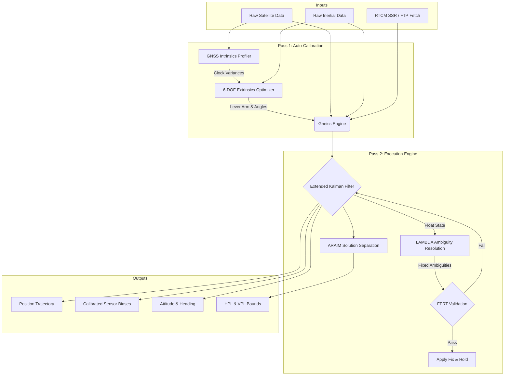

<p align="center">
  
</p>

# Gneiss Navigation Engine

Gneiss is a GNSS post-processing engine written in Rust, built around a double-difference Extended
Kalman Filter (EKF) with LAMBDA integer ambiguity resolution. The flagship target is post-processed
RTK for commercial hardware (u-blox); the estimator core is currently being hardened against
survey-grade CORS baseline data before being re-validated on consumer receiver hardware (tracked in
the roadmap's Sprint 11).

**This README describes the current engine as of Sprint 31.** See `docs/PROJECT_STATUS.md` for the authoritative status and
`docs/TIER1_ROADMAP.md` for the Tier-1 PPK/PPP/Realtime parity roadmap.

## Features

- **Double-difference RTK/PPK**: Iterated EKF over DD pseudorange/carrier-phase observations, forward
  + backward RTS smoothing with a measured-agreement combiner.
- **Tightly-Coupled GNSS/INS**: Sliding-window factor graph (SWFG) fusing high-rate on-manifold IMU
  preintegration (Forster et al.) with raw pseudorange/carrier-phase observation factors.
- **Ambiguity Resolution & PPP-AR**: LAMBDA integer AR for RTK and decoupled Wide-Lane/Narrow-Lane
  Melbourne-Wübbena integer resolution with fractional phase bias (OSB/DCB) absorption for PPP-AR.
- **Frame & Geodetic Safety**: Structurally enforced `EpochPosition<F, R>`, `Arp`, `Apc`, `GroundMonument`
  markers with tectonic plate velocity propagation ($\mathbf{X}(t_1) = \mathbf{X}(t_0) + \mathbf{V}(t_1 - t_0)$)
  and typed `TimeSystem` / `Signal` registries.
- **Antenna Phase Center Modeling**: Full 2D azimuth $\times$ elevation bilinear interpolation for ANTEX
  receiver PCV models and satellite PCO/PCV.
- **Enterprise Formats & Trajectories**: Full 17-field binary Applanix POSPac `.sbet` (136 bytes/epoch)
  and 10-field `.sbet.rms` (80 bytes/epoch) export, along with POS, CSV, KML, and GeoJSON.
- **Universal Geoid Grids & Projections**: Fast binary parsers for NOAA VDatum `.gtx`, NRCan `.byn`
  (CGG2013, HTv2), Transverse Mercator (UTM/Gauss-Krüger), Lambert Conformal Conic, and binary `.gsb` NTv2 datum shifts.
- **Photogrammetry & Site Calibration**: Boresight misalignment $[\Delta \phi, \Delta \theta, \Delta \psi]$ &
  lever-arm $\mathbf{l}_c$ Levenberg-Marquardt auto-estimator, shutter synchronization (`CameraEventInterpolator`),
  and 4-parameter horizontal Helmert + vertical slope site calibration (`gneiss-cli calibrate`).
- **Interactive Visual GUI & Diagnostics**: Single-binary embedded web workspace (`gneiss-cli gui`) with
  responsive Canvas trajectory rendering, polar skyplots, and multi-channel residual time-series inspectors.
- **Automated CORS Reference Harvester**: `gneiss-fetch` tool for automated discovery and Hatanaka RINEX
  retrieval from NOAA CORS, EUREF, and CDDIS networks.
- **Executive QC Reporting**: Publication-grade HTML/PDF certification reports (`--qc-report`) with KPI badges.
- **Multi-Core Parallelism**: Rayon-accelerated per-base forward/backward passes and batch mission execution.
- **Real-Time Streaming Engine & Live Mode**: `StreamingRtkEngine` with live RTCM3 MSM decoding and
  `gneiss-cli live` streaming runner with real-time NMEA 0183 `$GNGGA` sentence generation.

## Project Status & Strategic Roadmap

The project has executed all 3 prioritized phases of the Tier-1 master roadmap:
1. **Phase 1: PPK Post-Processing Dominance** (Sprints 1–25) — Achieving parity and superiority over NovAtel Waypoint GrafNav, SBG Qinertia, and Leica Infinity on PPK accuracy, throughput, and UX.
2. **Phase 2: High-Precision PPP & PPP-AR** (Sprints 26–28) — Global base-station-free centimeter positioning with precise SP3/CLK products, ZWD random walks, and integer PPP-AR.
3. **Phase 3: Real-Time & Streaming Operations** (Sprints 29–31) — High-throughput low-latency live RTCM3 streaming, `StreamingRtkEngine`, and live CLI runner.

See `docs/TIER1_ROADMAP.md` for the complete roadmap and `docs/PROJECT_STATUS.md` for comprehensive verification metrics.

## Architecture

The engine operates on a causal, recursive filtering architecture:



## Quickstart

Gneiss provides a command-line interface for testing and processing datasets. To run a tightly-coupled fusion pipeline with backward smoothing on a static dataset:

```bash
cargo run --release -p gneiss-cli -- process \
    --rover datasets/my_data/rover.obs \
    --base datasets/my_data/base.obs \
    --output trajectory.pos \
    --enable-imu-fusion \
    --enable-backward-smoothing \
    --lever-arm "0.1,0.0,-0.2"
```

To run the engine in real-time streaming mode using a serial port and an NTRIP base station:

```bash
cargo run --release -p gneiss-cli -- live \
    --port /dev/ttyACM0 \
    --baud 460800 \
    --ntrip-url rtk2go.com \
    --ntrip-mount MOUNT \
    --ntrip-user USER \
    --ntrip-pass PASS
```

### CLI Configuration (`process` subcommand)

- `--rover <PATH>`: **(Required)** Path to the rover's raw GNSS observations (RINEX `.obs`).
- `--base <PATH>`: Path to the base station's raw GNSS observations (RINEX `.obs`). Required for RTK/PPK. If omitted, the engine defaults to SPP (Single Point Positioning).
- `--output <PATH>`: **(Required)** Path for the resulting `.pos` trajectory file.
- `--config <PATH>`: Path to a JSON configuration file to override default EKF process noise and tuning parameters.
- `--enable-backward-smoothing`: Enables the Rauch-Tung-Striebel (RTS) backward smoother.

- `--lambda-ratio <FLOAT>`: Minimum ratio for the LAMBDA Partial Ambiguity Resolution (PAR) test (default: `3.0`).
- `--lambda-subset <INT>`: Minimum number of satellites required for PAR (default: `7`). 
- `--lever-arm <X,Y,Z>`: Translation vector (in meters) from the IMU center of navigation to the GNSS antenna phase center in the vehicle body frame.
- `--calibrate`: **(New)** Enables the automated 2-pass calibration pipeline. In Pass 1, the engine dynamically estimates GNSS receiver clock variance profiles and uses a Nelder-Mead simplex optimizer to auto-detect the 6-DOF IMU mounting angles and lever arms. In Pass 2, it executes the tight-coupling with the detected parameters. This is highly recommended for cold-starts without a-priori lever arm measurements.
- `--calibrate-imu`: Enables dynamic state-estimation of IMU mounting rotations relative to the vehicle frame.
- `--raim-outlier-m <FLOAT>`: SPP Receiver Autonomous Integrity Monitoring (RAIM) threshold in meters.
- `--chi-square-pr <FLOAT>`: EKF Chi-Square threshold for pseudorange measurement rejection.
- `--chi-square-cp <FLOAT>`: EKF Chi-Square threshold for carrier phase measurement rejection.

## Accuracy Benchmarks

**Current engine (network RTK/PPK), vs RTKLIB 2.4.3 b34, six CORS baselines, same raw data:**

| Metric | RTKLIB (default config) | Gneiss | Improvement |
|--------|--------------------------|--------|-------------|
| Average fix rate (6 baselines) | 43.9% | **83.5%** | 1.9x |
| P181 (15km) horizontal RMS | 119mm | **33mm** | 3.6x |
| P181 horizontal median | 113mm | **24mm** | 4.7x |

Caveat stated in `docs/PROJECT_STATUS.md`: RTKLIB was run with default options only, not fully tuned.
Beating it is necessary-but-not-sufficient evidence the estimator core is sound -- it is **not** a
Tier-1 (Leica / NovAtel / Qinertia) comparison, and no current-engine Tier-1 comparison exists yet
(roadmap Sprint 11 exists specifically to produce one). Full current tables, including the longer
38-50km baselines where atmospheric decorrelation dominates, are in `docs/PROJECT_STATUS.md` and
`docs/NETWORK_RTK_NEXT_STEPS.md`.

Numbers from the two earlier engine generations (RTK+INS urban-canyon benchmarks, PPP-AR fix rates)
are preserved in `docs/archive/` but describe superseded architectures -- do not cite them as current.

## Documentation

- [Current project status & sprint history](./docs/PROJECT_STATUS.md)
- [Tier-1 PPK Parity Roadmap](./docs/TIER1_ROADMAP.md)
- [Round-by-round development process](./RUNBOOK.md)
- [Frame-safety architecture](./docs/FRAME_SAFETY_PLAN.md)
- [Architecture details](./ARCHITECTURE.md) *(describes an earlier engine generation -- read with that in mind)*
- [Precise Point Positioning (PPP-AR) explained](./docs/PPP_AR_EXPLAINED.md) *(background/theory, still accurate)*
- Superseded planning docs & historical logs: [docs/archive/](./docs/archive/)

## Workspace Structure

| Crate | Purpose |
| :--- | :--- |
| [`gneiss-core`](./crates/gneiss-core) | Core data structures, physical constants, and geometric models. |
| [`gneiss-geodesy`](./crates/gneiss-geodesy) | Earth reference frames, datum transformations, and gravity models. |
| [`gneiss-parsers`](./crates/gneiss-parsers) | Decoders for standard positioning formats (RINEX, UBX, RTCM3). |
| [`gneiss-rtk`](./crates/gneiss-rtk) | The Extended Kalman Filter, mechanization, and ambiguity resolution logic. |
| [`gneiss-ntrip`](./crates/gneiss-ntrip) | Asynchronous networking client for RTK corrections. |
| [`gneiss-cli`](./bin/gneiss-cli) | Command-line interface for dataset processing and real-time execution. |
