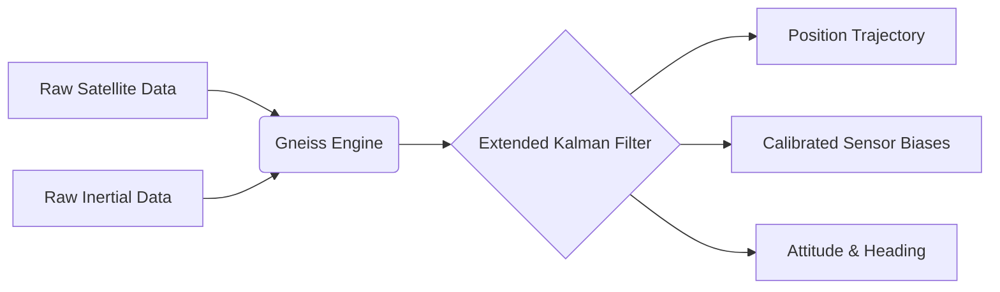

<p align="center">
  
</p>

# Gneiss Navigation Engine

Gneiss is a tightly-coupled GNSS and Inertial Navigation System (INS) engine written in Rust. It fuses raw satellite observations (pseudorange, carrier phase, and Doppler) with high-rate inertial sensors (accelerometer and gyroscope) using an Extended Kalman Filter (EKF).

The engine is designed for robust operation in multi-path environments, utilizing empirical statistical methods for outlier rejection and variance scaling.

## Features

- **Tightly-Coupled Integration**: Direct fusion of raw GNSS observations and IMU data within the primary state vector.
- **Adaptive Estimation**: Implements Innovation-based Adaptive Estimation (IAE) and Median Absolute Deviation (MAD) RAIM to scale observation variances dynamically.
- **Ambiguity Resolution**: Uses the LAMBDA (Least-squares AMBiguity Decorrelation Adjustment) algorithm for carrier-phase integer ambiguity resolution.
- **Post-Processing (PPK)**: Supports forward-backward Rauch-Tung-Striebel (RTS) smoothing to produce continuous trajectories from static files.
- **Real-Time Streaming**: `#![no_std]` compatible core engine, with a `tokio`-based `live` subcommand for streaming data via local UART and NTRIP casters.

## Project Status & Roadmap

The engine's architecture provides a mathematical scaffold for multiple GNSS processing modes. Currently, the project is heavily focused on optimizing **RTK + INS** workflows for urban canyon and challenging multipath environments.


  - Precise Point Positioning (PPP)
  - PPP + INS

**Features Included:**
  - Ionosphere-Free Linear Combinations for multi-frequency correction.
  - Zenith Wet Delay (ZWD) tropospheric estimation.
  - Advanced geophysical corrections (Solid Earth Tides, Satellite Phase Wind-Up).
  - CDDIS SP3 and precise clock (.clk) parsing via 10th-order Lagrange interpolation.
  - Intelligent Clock Jump State Preservation algorithms to prevent EKF divergence during TCXO adjustments.

## Architecture

The engine operates on a causal, recursive filtering architecture:



## Quickstart

Gneiss provides a command-line interface for testing and processing datasets. To run a tightly-coupled fusion pipeline with backward smoothing on a static dataset:

```bash
cargo run --release -p gneiss-cli -- process \
    --rover datasets/my_data/rover.obs \
    --base datasets/my_data/base.obs \
    --output trajectory.pos \
    --enable-imu-fusion \
    --enable-backward-smoothing \
    --lever-arm "0.1,0.0,-0.2"
```

To run the engine in real-time streaming mode using a serial port and an NTRIP base station:

```bash
cargo run --release -p gneiss-cli -- live \
    --port /dev/ttyACM0 \
    --baud 460800 \
    --ntrip-url rtk2go.com \
    --ntrip-mount MOUNT \
    --ntrip-user USER \
    --ntrip-pass PASS
```

### CLI Configuration (`process` subcommand)

- `--rover <PATH>`: **(Required)** Path to the rover's raw GNSS observations (RINEX `.obs`).
- `--base <PATH>`: Path to the base station's raw GNSS observations (RINEX `.obs`). Required for RTK/PPK. If omitted, the engine defaults to SPP (Single Point Positioning).
- `--output <PATH>`: **(Required)** Path for the resulting `.pos` trajectory file.
- `--config <PATH>`: Path to a JSON configuration file to override default EKF process noise and tuning parameters.
- `--enable-backward-smoothing`: Enables the Rauch-Tung-Striebel (RTS) backward smoother.

- `--lambda-ratio <FLOAT>`: Minimum ratio for the LAMBDA Partial Ambiguity Resolution (PAR) test (default: `3.0`).
- `--lambda-subset <INT>`: Minimum number of satellites required for PAR (default: `7`). 
- `--lever-arm <X,Y,Z>`: Translation vector (in meters) from the IMU center of navigation to the GNSS antenna phase center in the vehicle body frame.
- `--calibrate-imu`: Enables state-estimation of IMU mounting rotations (Roll, Pitch, Yaw) relative to the vehicle frame.
- `--raim-outlier-m <FLOAT>`: SPP Receiver Autonomous Integrity Monitoring (RAIM) threshold in meters.
- `--chi-square-pr <FLOAT>`: EKF Chi-Square threshold for pseudorange measurement rejection.
- `--chi-square-cp <FLOAT>`: EKF Chi-Square threshold for carrier phase measurement rejection.

## Documentation

For technical implementation details, see the following documents:
- [Architecture Details](./ARCHITECTURE.md)
- [Benchmark Methodology](./BENCHMARKS.md)

## Workspace Structure

| Crate | Purpose |
| :--- | :--- |
| [`gneiss-core`](./crates/gneiss-core) | Core data structures, physical constants, and geometric models. |
| [`gneiss-geodesy`](./crates/gneiss-geodesy) | Earth reference frames, datum transformations, and gravity models. |
| [`gneiss-parsers`](./crates/gneiss-parsers) | Decoders for standard positioning formats (RINEX, UBX, RTCM3). |
| [`gneiss-rtk`](./crates/gneiss-rtk) | The Extended Kalman Filter, mechanization, and ambiguity resolution logic. |
| [`gneiss-ntrip`](./crates/gneiss-ntrip) | Asynchronous networking client for RTK corrections. |
| [`gneiss-cli`](./bin/gneiss-cli) | Command-line interface for dataset processing and real-time execution. |
