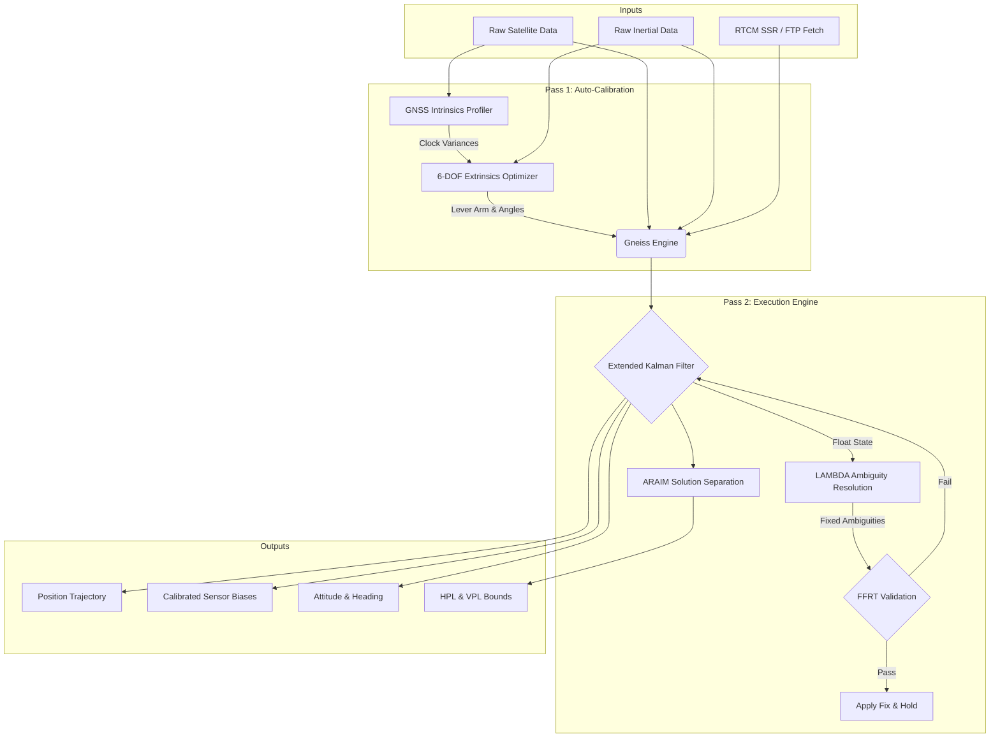

<p align="center">
  
</p>

# Gneiss Navigation Engine

Gneiss is a GNSS post-processing engine written in Rust, built around a double-difference Extended
Kalman Filter (EKF) with LAMBDA integer ambiguity resolution. The flagship target is post-processed
RTK for commercial hardware (u-blox); the estimator core is currently being hardened against
survey-grade CORS baseline data before being re-validated on consumer receiver hardware (tracked in
the roadmap's Sprint 11).

**This README describes the current (network RTK/PPK) engine as of Sprint 5.** Two earlier engine
generations exist in this repository's history -- a tightly-coupled GNSS+INS EKF, and a sliding-window
factor graph -- both superseded. Their docs are preserved under `docs/archive/` for historical record
only; do not treat them as current. See `docs/PROJECT_STATUS.md` for the authoritative status and
`docs/NETWORK_RTK_NEXT_STEPS.md` for the live findings log and roadmap.

## Features

- **Double-difference RTK/PPK**: Iterated EKF over DD pseudorange/carrier-phase observations, forward
  + backward RTS smoothing with a measured-agreement combiner.
- **Ambiguity Resolution**: LAMBDA integer AR with partial AR (ILS subset selection) and FFRT validation
  for GPS, Galileo, and BeiDou. GLONASS is implemented but gated off by default -- a >500-cycle-per-epoch
  FDMA phase mismatch is root-caused but not yet fixed (see `docs/NETWORK_RTK_NEXT_STEPS.md`, roadmap Sprint 9).
- **Frame safety**: Typed `TimeSystem`, `EcefPos<F>`, and `Signal` primitives prevent an entire class of
  silent GNSS/BeiDou time-offset and frequency-mixing bugs that were the majority of real defects found
  during development (see `docs/FRAME_SAFETY_PLAN.md`).
- **Atmospheric modeling**: Per-satellite mapped slant ionosphere state filter; NS-gradient troposphere
  states; 11-constituent Ocean Tide Loading via an IERS BLQ parser.
- **Precise products**: SP3 + RINEX clock + PCO wired via a unified staged pipeline, with broadcast-ephemeris
  fallback.
- **Robust estimation**: Huber-weighted IEKF update; validated to substantially reduce fix-rate tail error
  versus a naive least-squares update.
- **Real-time plumbing (not yet wired end-to-end)**: An async NTRIP client (`gneiss-ntrip`) and RTCM3
  MSM4/MSM7 decoder both exist; live-correction streaming into the estimator is tracked in roadmap Sprint 12.

## Project Status & Roadmap

The project has gone through three architecture generations; the current one (documented here) is
**network RTK/PPK against a network of CORS reference baselines** (15-50km), used to harden the
double-difference estimator core against clean, well-characterized truth data before it is
re-validated against the flagship target: commercial u-blox receiver hardware.

Sprints 1-5 (frame safety, precise products, slant ionosphere, troposphere/geodesy, production polish)
are complete. The active roadmap (sprints 6-13 -- tropospheric observability, obs-side clock refactor,
long-baseline ambiguity resolution, antenna/datum precision, Tier-1 and u-blox-hardware validation,
real-time path, production hardening) lives in `docs/NETWORK_RTK_NEXT_STEPS.md` and the project's
sprint roadmap artifact.

**Supported modes:** Single Point Positioning (SPP), Real-Time Kinematic / PPK (double-difference,
static and -- behind a flag, not yet production-validated -- kinematic).

## Architecture

The engine operates on a causal, recursive filtering architecture:



## Quickstart

Gneiss provides a command-line interface for testing and processing datasets. To run a tightly-coupled fusion pipeline with backward smoothing on a static dataset:

```bash
cargo run --release -p gneiss-cli -- process \
    --rover datasets/my_data/rover.obs \
    --base datasets/my_data/base.obs \
    --output trajectory.pos \
    --enable-imu-fusion \
    --enable-backward-smoothing \
    --lever-arm "0.1,0.0,-0.2"
```

To run the engine in real-time streaming mode using a serial port and an NTRIP base station:

```bash
cargo run --release -p gneiss-cli -- live \
    --port /dev/ttyACM0 \
    --baud 460800 \
    --ntrip-url rtk2go.com \
    --ntrip-mount MOUNT \
    --ntrip-user USER \
    --ntrip-pass PASS
```

### CLI Configuration (`process` subcommand)

- `--rover <PATH>`: **(Required)** Path to the rover's raw GNSS observations (RINEX `.obs`).
- `--base <PATH>`: Path to the base station's raw GNSS observations (RINEX `.obs`). Required for RTK/PPK. If omitted, the engine defaults to SPP (Single Point Positioning).
- `--output <PATH>`: **(Required)** Path for the resulting `.pos` trajectory file.
- `--config <PATH>`: Path to a JSON configuration file to override default EKF process noise and tuning parameters.
- `--enable-backward-smoothing`: Enables the Rauch-Tung-Striebel (RTS) backward smoother.

- `--lambda-ratio <FLOAT>`: Minimum ratio for the LAMBDA Partial Ambiguity Resolution (PAR) test (default: `3.0`).
- `--lambda-subset <INT>`: Minimum number of satellites required for PAR (default: `7`). 
- `--lever-arm <X,Y,Z>`: Translation vector (in meters) from the IMU center of navigation to the GNSS antenna phase center in the vehicle body frame.
- `--calibrate`: **(New)** Enables the automated 2-pass calibration pipeline. In Pass 1, the engine dynamically estimates GNSS receiver clock variance profiles and uses a Nelder-Mead simplex optimizer to auto-detect the 6-DOF IMU mounting angles and lever arms. In Pass 2, it executes the tight-coupling with the detected parameters. This is highly recommended for cold-starts without a-priori lever arm measurements.
- `--calibrate-imu`: Enables dynamic state-estimation of IMU mounting rotations relative to the vehicle frame.
- `--raim-outlier-m <FLOAT>`: SPP Receiver Autonomous Integrity Monitoring (RAIM) threshold in meters.
- `--chi-square-pr <FLOAT>`: EKF Chi-Square threshold for pseudorange measurement rejection.
- `--chi-square-cp <FLOAT>`: EKF Chi-Square threshold for carrier phase measurement rejection.

## Accuracy Benchmarks

**Current engine (network RTK/PPK), vs RTKLIB 2.4.3 b34, six CORS baselines, same raw data:**

| Metric | RTKLIB (default config) | Gneiss | Improvement |
|--------|--------------------------|--------|-------------|
| Average fix rate (6 baselines) | 43.9% | **83.5%** | 1.9x |
| P181 (15km) horizontal RMS | 119mm | **33mm** | 3.6x |
| P181 horizontal median | 113mm | **24mm** | 4.7x |

Caveat stated in `docs/PROJECT_STATUS.md`: RTKLIB was run with default options only, not fully tuned.
Beating it is necessary-but-not-sufficient evidence the estimator core is sound -- it is **not** a
Tier-1 (Leica / NovAtel / Qinertia) comparison, and no current-engine Tier-1 comparison exists yet
(roadmap Sprint 11 exists specifically to produce one). Full current tables, including the longer
38-50km baselines where atmospheric decorrelation dominates, are in `docs/PROJECT_STATUS.md` and
`docs/NETWORK_RTK_NEXT_STEPS.md`.

Numbers from the two earlier engine generations (RTK+INS urban-canyon benchmarks, PPP-AR fix rates)
are preserved in `docs/archive/` but describe superseded architectures -- do not cite them as current.

## Documentation

- [Current project status & sprint history](./docs/PROJECT_STATUS.md)
- [Live findings log & architecture roadmap](./docs/NETWORK_RTK_NEXT_STEPS.md)
- [Round-by-round development process](./RUNBOOK.md)
- [Frame-safety architecture](./docs/FRAME_SAFETY_PLAN.md)
- [Architecture details](./ARCHITECTURE.md) *(describes an earlier engine generation -- read with that in mind)*
- [Precise Point Positioning (PPP-AR) explained](./docs/PPP_AR_EXPLAINED.md) *(background/theory, still accurate)*
- Superseded planning docs: [docs/archive/](./docs/archive/)

## Workspace Structure

| Crate | Purpose |
| :--- | :--- |
| [`gneiss-core`](./crates/gneiss-core) | Core data structures, physical constants, and geometric models. |
| [`gneiss-geodesy`](./crates/gneiss-geodesy) | Earth reference frames, datum transformations, and gravity models. |
| [`gneiss-parsers`](./crates/gneiss-parsers) | Decoders for standard positioning formats (RINEX, UBX, RTCM3). |
| [`gneiss-rtk`](./crates/gneiss-rtk) | The Extended Kalman Filter, mechanization, and ambiguity resolution logic. |
| [`gneiss-ntrip`](./crates/gneiss-ntrip) | Asynchronous networking client for RTK corrections. |
| [`gneiss-cli`](./bin/gneiss-cli) | Command-line interface for dataset processing and real-time execution. |
