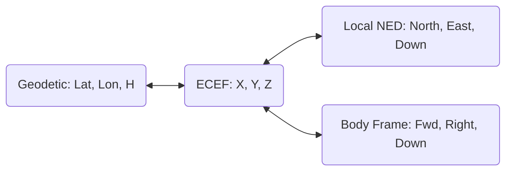

# gneiss-core

The geodetic bedrock of the Gneiss engine. This crate provides the physical constants and coordinate transformations required for high-precision navigation.

## Overview

Accuracy is a consequence of correct foundations. `gneiss-core` provides the following:

- **Coordinate Systems**: Rigorous transformations between Earth-Centered Earth-Fixed (ECEF), Geodetic, and local tangent plane (NED) frames.
- **Time Management**: Handling of Global Positioning System (GPS) time, including week rollovers and leap seconds.
- **Physical Models**: WGS84 gravity harmonics and atmospheric delay models (Saastamoinen troposphere, Klobuchar ionosphere).

## Visualizing the Bedrock

---

*Gneiss-core: Earth is round-ish. We have the equations for that.*
