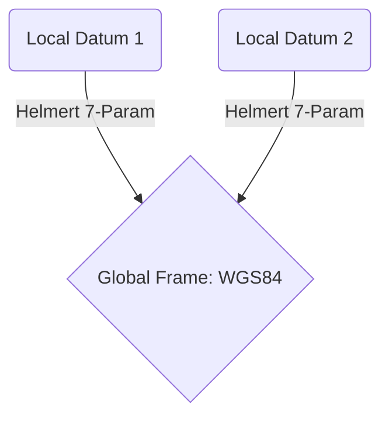

# gneiss-geodesy

The precise geographer of Gneiss. This crate provides advanced geodetic transformations and datum management.

## Overview

Accuracy is relative—specifically, it is relative to a datum. `gneiss-geodesy` ensures that we are always pointing at the right spot on the earth, accounting for its geoid shape and local variations.

### Key Capabilities

- **Helmert Transformations**: 7-parameter spatial transformations between different geodetic datums.
- **Antex Support**: Parsing and applying Antenna Exchange format offsets to correct for phase center variations.
- **Reference Ellipsoids**: Support for WGS84, GRS80, and other standard planetary models.

## Transforming the World



## The Helmert Equation

We move between worlds using a rotation, a translation, and a scale.

```text
    Helmert Transformation:
    -----------------------
    X_new = T + (1 + s) * R * X_old
    
    T: [tx, ty, tz]     - Translation
    R: [rx, ry, rz]     - Rotation
    s: scale            - Part-per-million offset
```

---
