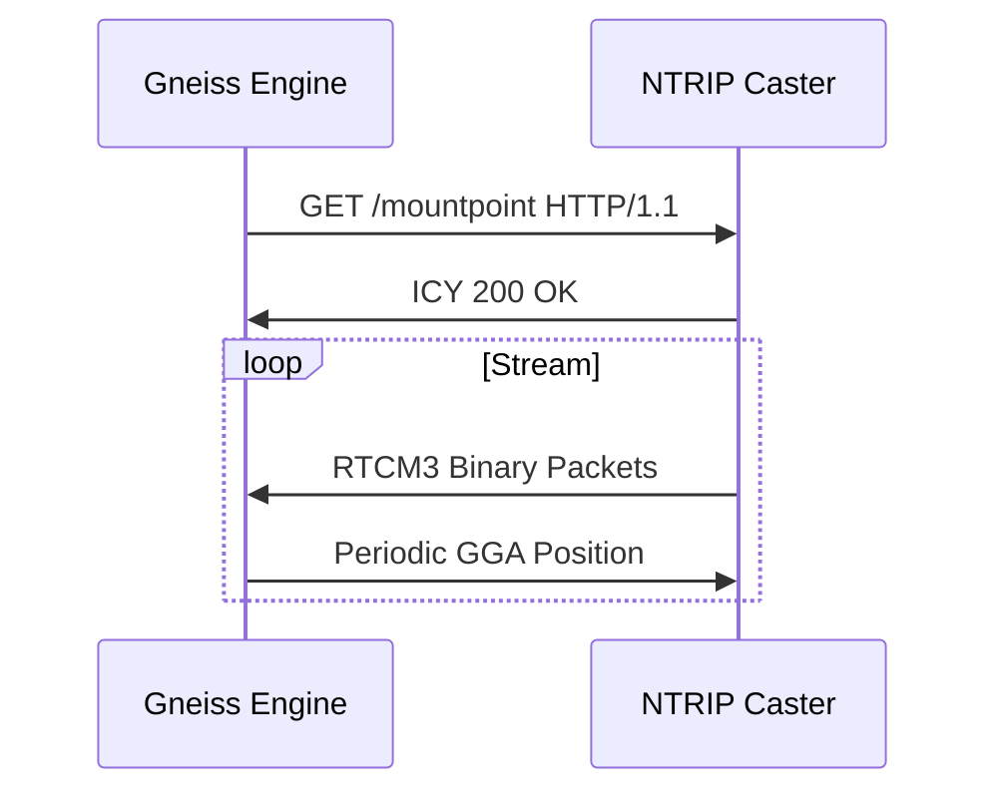

# gneiss-ntrip

The networked connector for Gneiss. This crate provides an asynchronous client for the Networked Transport of RTCM via Internet Protocol.

## Overview

Real-Time Kinematic positioning requires a baseline—a correction stream from a known location. `gneiss-ntrip` reaches out across the internet to stream these vital observations into the processing engine.

### Features

- **Asynchronous I/O**: Built on `tokio` for non-blocking stream ingestion.
- **Source Table Support**: Automatically parses and selects mounting points from NTRIP casters.
- **Base Station Handshaking**: Handles authentication and periodic NMEA position reporting to maintain the stream.

## The Connection Sequence

## Protocol Basics

NTRIP is essentially a continuous stream of binary Radio Technical Commission for Maritime Services (RTCM) data wrapped in a persistent Hypertext Transfer Protocol (HTTP) connection.

---

*Gneiss-ntrip: Sourcing the baseline.*
