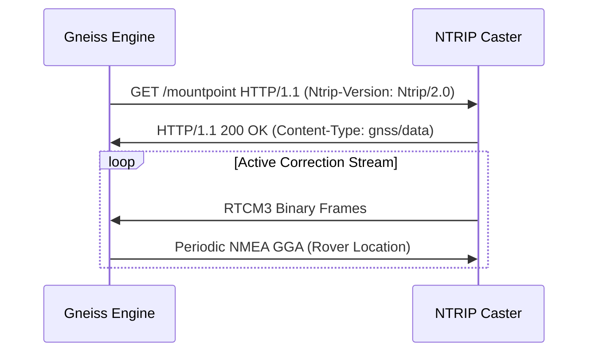

# gneiss-ntrip

`gneiss-ntrip` provides an asynchronous client for streaming differential GNSS corrections over NTRIP (Networked Transport of RTCM via Internet Protocol) v1.0 and v2.0.

## Capabilities

- **Asynchronous Stream Management**: Built on `tokio` for non-blocking I/O and frame demuxing.
- **Sourcetable Parsing**: Fetches and parses caster sourcetables to discover available mountpoints, supported formats (RTCM 2.x, 3.x), carrier frequencies, and reference station coordinates.
- **Authentication**: Supports HTTP Basic and Digest authentication schemes.
- **NMEA Position Feedback**: Dispatches periodic NMEA-0183 GGA messages to virtual reference station (VRS) casters for dynamic network synthesis.
- **Resilient Streaming**: Automatic reconnection with exponential backoff on network interruption.

## Architecture

