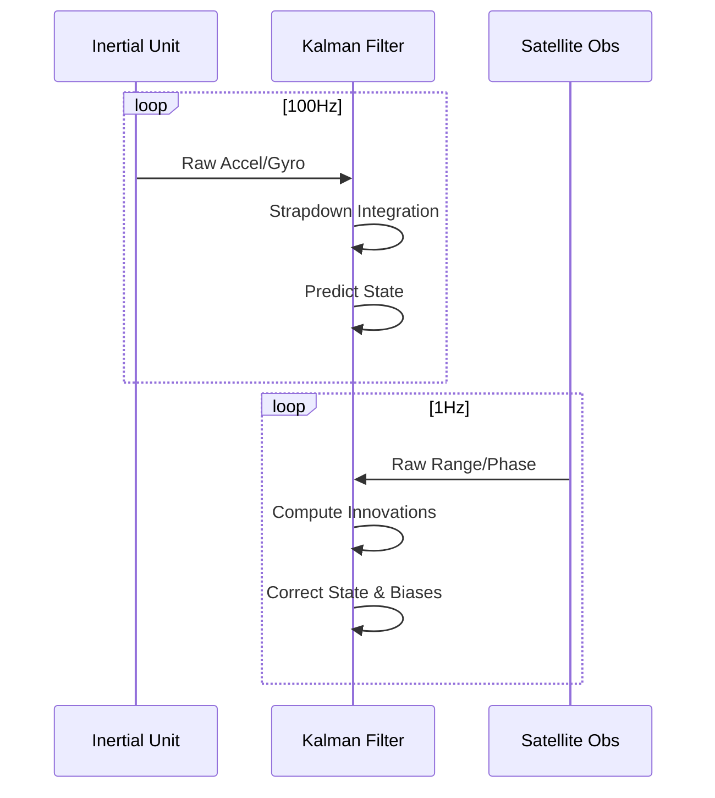

# gneiss-rtk

The clockwork of Gneiss. This crate implements the processing algorithms for Real-Time Kinematic positioning and Tightly-Coupled sensor fusion.

## Overview

We handle the complex orchestration of filtering and optimization with a precision that makes it look easy.

### Key Capabilities

- **Tightly-Coupled Filter**: Raw range and phase residuals are fused directly with inertial error states.
- **LAMBDA Engine**: Full implementation of the Least-squares AMBiguity Decorrelation Adjustment.
- **Constraints**: Non-Holonomic Constraints (NHC) and Zero-Velocity Updates (ZUPT) to stabilize the trajectory.

## The Fusion Loop

---

*Gneiss-rtk: The math works. The results are merely a consequence.*
