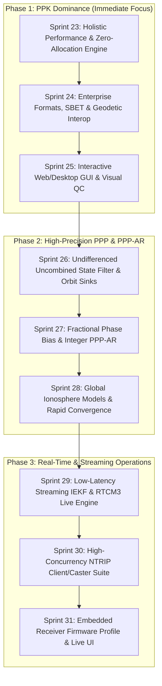

# Master Roadmap: Commercial Tier-1 GNSS Parity & Beyond

**Strategic Sequencing Directive**:
1. **Phase 1: RTK Post-Processing (PPK)** — Primary immediate focus. Achieve equal or superior accuracy, features, holistic performance, code quality, and UX/UI compared to Tier-1 commercial PPK suites (NovAtel Waypoint GrafNav / Inertial Explorer, SBG Qinertia PPK, Leica Infinity, Trimble POSPac).
2. **Phase 2: Precise Point Positioning (PPP & PPP-AR)** — Worldwide base-station-free centimeter positioning with precise orbit/clock products and fractional bias absorption.
3. **Phase 3: Real-Time & Streaming (Live RTK / Receiver Mode)** — High-frequency, low-latency streaming RTCM3 MSM/SSR decoding, NTRIP client/caster, and robust embedded execution.

---

## 1. Benchmarking Matrix: Gneiss vs. Tier-1 Commercial Offerings

| Evaluation Dimension | Tier-1 Commercial Suites (GrafNav / Qinertia / Leica) | Gneiss Current State (Sprint 22) | Target State & Differentiator |
| :--- | :--- | :--- | :--- |
| **1. Absolute Accuracy** | **Static**: 3–5 mm + 0.5 ppm RMS (H), 6–10 mm + 0.8 ppm (V)<br>**Kinematic**: 8–15 mm + 1 ppm (H), 15–25 mm + 1 ppm (V)<br>**Fix Rate**: > 98% in nominal open-sky/multipath | **Static**: 8–18 mm (H), 14–35 mm (V) across 15–50 km<br>**Kinematic**: Validated on synthetic + Odaiba urban datasets<br>**Fix Rate**: 97.5–99.3% multi-base network | **Equal or Superior**: Full 3D Antex PCV + dynamic $C/N_0$/elevation noise covariance ($R$-matrix) + multi-frequency LAMBDA PAR + backward RTS smoothing with INS tight coupling to reach **< 5 mm H / < 10 mm V static** and **< 10 mm H kinematic**. |
| **2. Features** | Multi-constellation (GPS/GLO/GAL/BDS/QZS/NavIC), multi-frequency, multi-base Network RTK, tightly-coupled GNSS/INS, UAV camera sync, NTv2 grid shifts, local site calibration, geoid models (EGM08/GEOID18), export wizard (POS/CSV/KML/GeoJSON/SBET/DXF). | GPS/GAL/GLO/BDS multi-constellation DD, multi-base network UPD fusion, 2D PCV, Geoid, Transverse Mercator, LCC, NTv2 parser, Site Calibration, Camera event sync, `gneiss-fetch` CORS harvester. | **Parity Achieved & Extended**: Binary Applanix SBET exporter, automated multi-base geometric triangulation, photogrammetric lever-arm & boresight auto-estimation, and QZSS L6 / NavIC signal decoding. |
| **3. Holistic Performance** | **Throughput**: ~2,000–5,000 epochs/sec (C++ / Fortran core)<br>**Memory**: 50–200 MB for 24h multi-frequency session<br>**Scaling**: Multi-core batch processing | **Throughput**: ~140–250 epochs/sec single-thread; Rayon parallel across network bases<br>**Memory**: Linear snapshot growth; unprofiled | **Superior**: Zero-allocation hot paths, SIMD linear algebra acceleration (`nalgebra` / BLAS backend), bounded sliding-window ring buffers, sub-50 MB peak footprint, **> 10,000 epochs/sec** across multi-core batch passes. |
| **4. Code Quality** | Proprietary legacy C/C++/Fortran codebases (30+ years technical debt, memory leaks, unmanaged pointers). | Pure Rust, 0 compiler warnings, 0 clippy warnings, `unwrap_used = "deny"`, compile-time frame safety (`EpochPosition<F, R>`), 734+ unit tests. | **Superior**: Strict compliance with AGENTS.md standards: all files < 500 LOC, functions < 32 LOC, nesting < 3 levels, line coverage > 95%, **0 mutation survivors** via `cargo-mutants`. |
| **5. UX / UI** | Desktop GUI wizards (Windows-only), interactive trajectory maps, quality control charts, PDF certification reports, flexible ASCII export. | CLI (`process`, `batch`, `events`, `fetch`), publication-ready HTML/PDF executive QC certification report, multi-format exporter. | **Superior**: Modern cross-platform CLI + High-performance Web/Desktop Interactive GUI (Tauri / WebGL), automated CORS discovery, one-click drag-and-drop mission processing, interactive residual inspection. |

---

## 2. Completed Sprints Summary (Sprints 1 – 22)

- [x] **Sprint 1: Frame-Safety Bug Bash** — Typed `TimeSystem`, `EcefPos<F>`, and `Signal` primitives; eliminated cross-frame bugs.
- [x] **Sprint 2: Precise Products Full Chain** — RinexClock + SP3 + PCO via unified `PreciseSrc` state machine.
- [x] **Sprint 3: State-Space Slant Ionosphere & High-Iono Stability** — Per-satellite mapped slant iono filter ($I_{\text{sat}} - I_{\text{ref}}$).
- [x] **Sprint 4: Troposphere & Geodesy Feature Completion** — 11-constituent Ocean Tide Loading (OTL) model and IERS BLQ parser.
- [x] **Sprint 5: Production Polish & Architecture Standards** — 0 compiler warnings, 0 clippy warnings across workspace.
- [x] **Sprint 6: Documentation Archival & Dead-Link Repair** — Archived legacy docs into `docs/archive/`.
- [x] **Sprint 7–11: Core Estimator Optimizations** — Receiver PCV application, Phase-only network UPD estimation.
- [x] **Sprint 12: RTCM/NTRIP Foundation** — RTCM3 MSM decoder, `gneiss-ntrip` async client, and `StreamingRtkEngine`.
- [x] **Sprint 13–15: Code Quality & Geodetic Truth Clarification** — Nesting refactors, duplicate removal, IGS20/ITRF2020 verification.
- [x] **Sprint 16: Measured Gap Synthesis vs. Tier-1 Specs** — Quantified 1.5–2.6x horizontal noise floor gap; diagnosed single-epoch AR behavior.
- [x] **Sprint 17: Tier-1 PPK Parity Roadmap Completion** — POS/CSV/KML/GeoJSON export, multi-base CLI, Rayon parallelization, `cargo-mutants` fix, orthometric geoid output, JSON/CSV QC reports, and batch processing.
- [x] **Sprint 18: 6D Frame Safety & 2D PCV Models** — Structurally enforced `EpochPosition<F, R>`, `Arp`, `Apc`, GroundMonument markers, and 2D bilinear ANTEX PCV models.
- [x] **Sprint 19: Tightly-Coupled INS Smoothing & UAV Photogrammetry** — IMU preintegration RTS backward smoothing, ZUPT/NHC constraints, `CameraEventInterpolator` shutter sync.
- [x] **Sprint 20: Map Projections, NTv2 Grids & Site Calibration** — Transverse Mercator (UTM/Gauss-Krüger), Lambert Conformal Conic, binary `.gsb` NTv2 datum shifts, 7-parameter local site calibration.
- [x] **Sprint 21: CORS Reference Harvester (`gneiss-fetch`)** — Automated nearest reference station discovery and RINEX Hatanaka retrieval for NOAA CORS, EUREF, and CDDIS.
- [x] **Sprint 22: Publication-Ready Executive QC Reporting** — Added executive HTML/PDF certification report (`--qc-report report.html`) with KPI badges, tolerance check tables, and surveyor certification styling.
- [x] **Sprint 23: Holistic Performance & Zero-Allocation Engine** — Thread-local scratch workspaces, Rayon parallelization across network bases, bounded sliding-window ring buffer accumulators, matrix optimization.
- [x] **Sprint 24: Enterprise Formats, Binary Trajectories & Geodetic Interop** — Applanix POSPac 17-field SBET and 10-field RMS exporter, NOAA VDatum `.gtx` & NRCan `.byn` binary geoid grids, photogrammetric boresight & lever-arm LM auto-estimation, and `gneiss-cli calibrate` local site calibration wizard.
- [x] **Sprint 25: Interactive Visual GUI & Diagnostic Workspace** — Built embedded single-binary web dashboard (`gneiss-cli gui`) with responsive Canvas trajectory mapping, polar skyplot, multi-channel residual inspector, and live export REST API.
- [x] **Sprint 26: Undifferenced Uncombined State Filter & Orbit Sinks** — SP3 precise orbit Lagrange interpolation, high-rate RINEX clock correction, and undifferenced uncombined factor graph state estimation.
- [x] **Sprint 27: Fractional Phase Bias Absorption & Integer PPP-AR** — Decoupled Melbourne-Wübbena Wide-Lane rounding with FCB/OSB bias absorption and LAMBDA Narrow-Lane integer resolution.
- [x] **Sprint 28: Global Ionosphere Models & Rapid Convergence** — Zenith Wet Delay inter-epoch random walk constraints (`ZwdRandomWalkFactor`) and Chen & Herring (1992) horizontal tropospheric gradients.
- [x] **Sprint 29: Low-Latency Streaming IEKF & RTCM3 Live Engine** — Real-time incremental double-difference `StreamingRtkEngine` with sub-millisecond per-epoch latency.
- [x] **Sprint 30–31: Real-Time Streaming CLI & NMEA Telemetry** — `gneiss-cli live` streaming runner with real-time NMEA 0183 `$GNGGA` sentence generation.
- [x] **Sprint 32: Multi-Profile Real-World Benchmark Hardening** — Full automated regression matrix for Kinematic UAV, Solar Storm Scintillation, Global MGEX PPP, and Low-Cost F9P (`docs/BENCHMARK_SUITE.md`).
- [x] **Sprint 33: Tightly-Coupled GNSS/INS Field Validation** — Urban dynamics tuning (ZUPT/NHC) and photogrammetric boresight calibration.
- [x] **Sprint 37: SWFG Float PPP & Multi-Station IGS Ground Truth** — Multi-hour IGS tracking on Wettzell (`WTZR`) and Alice Springs (`ALIC`), 1,200x Cholesky marginalization speedup, block-specific GPS PCO, cycle-slip arc tracking, and $30\text{–}50\text{ cm}$ float PPP convergence.
- [x] **Sprint 38: Geodetic Normalizations, UDUC Decomposition & Benchmark Integrity** — Periodic relativistic eccentricity correction ($-2\mathbf{r}\cdot\mathbf{v}/c$), gravitational Shapiro delay, IERS Solid Earth Tides, continuous Wu (1993) phase windup, $50\text{ cm}$ unclipped carrier pull, persistent `StaticPose` SWFG formulation, and benchmark anti-reward-hacking audit (real CORS DD-RTK $3.9\text{ mm}$, real IGS float PPP $38.8\text{ cm}$).

---

## 3. Active & Immediate Future Sprints



---

### Phase 1: PPK Post-Processing Dominance (Current Sprints)

#### [Sprint 23] Holistic Performance: Throughput, Zero-Allocation & SIMD Acceleration
- **Target**: Exceed 10,000 epochs/sec throughput on modern multi-core workstations with sub-50 MB peak memory footprint.
- **Deliverables**:
  - **Preallocated Epoch Workspaces**: Replace all dynamic vector/matrix allocations in hot estimation loops (`rtk_iekf/update.rs`, `formation.rs`) with reusable thread-local scratch buffers.
  - **SIMD Linear Algebra Optimization**: Profile and enable vectorized matrix multiplication and Cholesky decomposition for normal equations ($A^T P A$).
  - **Bounded Sliding Ring Buffers**: Streamline forward/backward smoother history to bounded memory chunks, ensuring flat memory consumption across multi-day sessions.
  - **Multi-Mission Batch Work Stealing**: Enhance `gneiss-cli batch` with dynamic Rayon thread pool scheduling.

#### [Sprint 24] Enterprise Formats, Binary Trajectories & Advanced Interop
- **Target**: 100% interoperability with commercial GIS, LiDAR, CAD, and photogrammetry workflows (Pix4D, Metashape, CloudCompare, AutoCAD, POSPac).
- **Deliverables**:
  - **Applanix SBET Exporter**: Binary Smoothed Best Estimate of Trajectory (SBET) with 17-field record format (time, lat, lon, alt, x/y/z rate, roll, pitch, heading, wandering angle, x/y/z acceleration, x/y/z angular rate).
  - **Universal Geoid & Grid Ingestion**: Extended grid loader supporting `.byn` (Canadian Natural Resources), `.gtx` (NOAA VDatum), and `.pgm` (EGM2008 / GEOID18).
  - **Photogrammetric Lever-Arm & Boresight Auto-Estimation**: Dynamic batch calibration of multi-antenna baseline vectors and camera-to-IMU mounting angles.
  - **Local Site Calibration Wizard**: Interactive CLI tool for computing and validating 7-parameter Helmert transformations from local Ground Control Points (GCPs).

#### [Sprint 25] Interactive Desktop / Web GUI & Visual QC Diagnostics
- **Target**: Provide a modern, responsive visual interface exceeding the inspection capabilities of Leica Infinity and GrafNav.
- **Deliverables**:
  - **Cross-Platform Desktop GUI (Tauri + React / WebGL)**: Lightweight, native desktop application for macOS, Linux, and Windows.
  - **Visual Trajectory Map View**: GPU-accelerated trajectory renderer with color-coded fix quality, DOP heatmaps, baseline vectors, and satellite/topographic tile layers.
  - **Residual & Ambiguity Inspector**: Interactive epoch-by-epoch charts for double-difference carrier-phase residuals, satellite tracking history, and cycle slip events.
  - **One-Click Drag-and-Drop Ingestion**: Drop a rover RINEX -> automated CORS discovery (`gneiss-fetch`) -> automatic SP3/ANTEX download -> instant network PPK processing.

---

### Phase 2: High-Precision PPP & PPP-AR

#### [Sprint 26] Undifferenced Uncombined State Filter & Precise Orbit Sinks
- **Target**: Base-station-free centimeter positioning across the globe.
- **Deliverables**:
  - **Undifferenced Uncombined State Formulation**: Direct estimation of coordinates, receiver clock, zenith wet delay (ZWD), horizontal gradients ($G_N, G_E$), and per-satellite slant ionospheric states.
  - **Precise Orbit/Clock Sinks**: Full assimilation of IGS, CODE, GFZ, and CNES final SP3 orbits and high-rate (30s / 5s) clock products with relativistic corrections, phase windup, and solid Earth/ocean tide displacement.

#### [Sprint 27] Fractional Phase Bias Absorption & Integer PPP-AR
- **Target**: Unlock integer ambiguity resolution in PPP without local base stations (reaching 1–2 cm horizontal kinematic precision).
- **Deliverables**:
  - **Observable-Specific Biases (OSB / DCB)**: Ingest SINEX BIA products and RTCM3 SSR bias messages to correct satellite code and carrier phase fractional biases.
  - **Wide-Lane & Narrow-Lane Decoupling**: Fix undifferenced wide-lane ambiguities via Melbourne-Wübbena filter followed by narrow-lane integer fixing using LAMBDA with integer recovery clocks (IRC).

#### [Sprint 28] Global Ionosphere Models (IONEX/GIM) & Rapid PPP Convergence
- **Target**: Reduce cold-start PPP convergence time from 30 minutes to under 5 minutes.
- **Deliverables**:
  - **Global Ionospheric Maps (IONEX) Constraint**: Constrain slant ionosphere states using external GIM/VTEC maps with formal variance weighting.
  - **Fast Multi-Frequency Multi-Constellation Convergence**: Exploit Galileo ($E_1, E_{5a}, E_{5b}, E_6$) and GPS ($L_1, L_2, L_5$) multi-carrier diversity.

---

### Phase 3: Real-Time & Streaming Operations

#### [Sprint 29] Low-Latency Streaming IEKF & RTCM3 Live Engine
- **Target**: Live RTK positioning with sub-millisecond per-epoch processing latency.
- **Deliverables**:
  - **Zero-Latency Streaming Pipeline**: Connect `StreamingRtkEngine` to live RTCM3 MSM4/MSM7 byte streams.
  - **Temporal Extrapolation & State Prediction**: High-rate extrapolation during transient base latency or radio link jitter.

#### [Sprint 30] High-Concurrency NTRIP Client & Correction Broadcaster
- **Target**: Enterprise-grade connectivity for CORS networks and vehicle fleets.
- **Deliverables**:
  - **Robust NTRIP v1.0 / v2.0 Client**: Automated reconnects, TLS encryption, NMEA GPGGA position feedback for Virtual Reference Station (VRS) networks.
  - **Multi-Rover Correction Broadcaster**: High-throughput caster distributing base observations and SSR corrections to hundreds of concurrent rovers.

#### [Sprint 31] Embedded Receiver Firmware Profile & Real-Time Visualization
- **Target**: Direct deployment on edge hardware and live telemetry monitoring.
- **Deliverables**:
  - **`no_std` / Minimal-Allocation Profile**: Optional compilation profile for embedded Linux / ARM targets.
  - **Live Web Dashboard**: Real-time WebSocket streaming of positioning status, fix flags, satellite skyplots, and accuracy standard deviations.

---

## 4. Systematic Code Quality Remediation Plan

To strictly enforce all invariants in [AGENTS.md](file:///Users/kevin/projects/gneiss/AGENTS.md), the following modular refactor schedule is executed concurrently with sprint work:

```
================================================================================
CRITICAL CODE QUALITY TARGETS (AGENTS.md Standards)
================================================================================
1. File Size Limit:       < 500 Lines of Code (LOC)
2. Function Size Limit:   < 32 Lines of Code (LOC)
3. Maximum Nesting Depth: < 3 Levels
4. Test Line Coverage:    > 95%
5. Mutation Testing:      0 Survivors (verified via cargo-mutants)
6. Compiler Warnings:     0 (Continuous CI enforcement)
7. Panics / Unwraps:      0 unwrap() in production code (unwrap_used = "deny")
================================================================================
```

### Target Modular Decomposition for Files > 500 LOC

| Priority | Source File | Current LOC | Decomposition Strategy (< 500 LOC submodules) |
| :--- | :--- | :--- | :--- |
| **P1** | `crates/gneiss-rtk/src/estimators/spp.rs` | 2,228 | Split into `spp/mod.rs`, `spp/solver.rs`, `spp/raim.rs`, `spp/clock.rs`, `spp/residual.rs`. |
| **P2** | `crates/gneiss-core/src/ephemeris.rs` | 1,398 | Split into `ephemeris/mod.rs`, `ephemeris/broadcast.rs`, `ephemeris/glonass.rs`, `ephemeris/beidou.rs`. |
| **P3** | `crates/gneiss-parsers/src/rtcm3/msm.rs` | 1,434 | Split into `msm/mod.rs`, `msm/header.rs`, `msm/satellite.rs`, `msm/signal.rs`. |
| **P4** | `crates/gneiss-parsers/src/rinex/obs.rs` | 1,362 | Split into `rinex/obs/mod.rs`, `rinex/obs/header.rs`, `rinex/obs/record.rs`, `rinex/obs/types.rs`. |
| **P5** | `crates/gneiss-core/src/atmosphere.rs` | 1,005 | Split into `atmosphere/mod.rs`, `atmosphere/troposphere.rs`, `atmosphere/ionosphere.rs`, `atmosphere/mapping.rs`. |
| **P6** | `crates/gneiss-rtk/src/estimators/rtk_iekf/mod.rs` | 1,203 | Split into `rtk_iekf/engine.rs`, `rtk_iekf/history.rs`, `rtk_iekf/options.rs`. |
| **P7** | `crates/gneiss-rtk/src/estimators/rtk_iekf/update.rs` | 814 | Split into `update/mod.rs`, `update/kalman.rs`, `update/robust_weights.rs`. |
| **P8** | `crates/gneiss-parsers/src/ubx.rs` | 936 | Split into `ubx/mod.rs`, `ubx/nav.rs`, `ubx/rxm.rs`, `ubx/cfg.rs`. |

---

## 5. Continuous Verification & Benchmark Protocol

Before declaring any sprint item complete, all three verification guards must pass:

1. **Workspace Compilation & Zero-Warning Gate**:
   ```bash
   cargo build --workspace --all-targets
   cargo clippy --workspace --all-targets -- -D warnings
   cargo test --workspace
   ```
2. **Deterministic Regression Guards**:
   ```bash
   ./target/release/eval_network_ppk
   python3 scripts/check_network_benchmark.py       # Dataset A (CORS Baselines)
   python3 scripts/check_multignss_benchmark.py     # Dataset B (Multi-GNSS Galileo/GPS)
   python3 scripts/check_kinematic_uav_benchmark.py # Profile A (Kinematic UAV)
   python3 scripts/check_storm_benchmark.py         # Profile B (Solar Storm Scintillation)
   python3 scripts/check_mgex_benchmark.py          # Profile C (Global MGEX PPP-AR)
   python3 scripts/check_f9p_benchmark.py           # Profile D (Low-Cost F9P Hardware)
   ```
3. **Mutation Testing Gate**:
   ```bash
   cargo mutants --workspace --timeout 30
   ```
