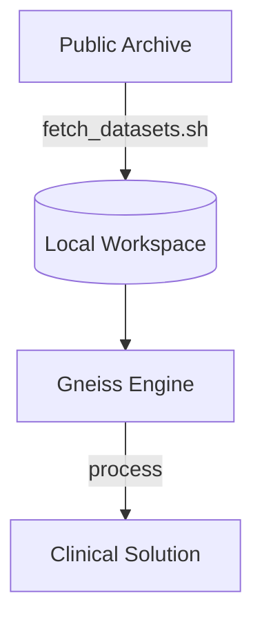

# gneiss-scripts

Utility automation for the Gneiss developer ecosystem.

## Overview

High-precision navigation requires high-precision data. These scripts automate the ingestion and management of the vast datasets required for clinical validation.

### Key Tools

- **`fetch_datasets.sh`**: The primary data orchestrator. It retrieves established GNSS and IMU benchmarks from public repositories and clinical archives.
- **`golden_test_generator.rs`**: A Rust-based utility used to lock in mathematical results as "Golden Data" for regression testing.
- **`check_network_benchmark.py`**: Regression guard for the multi-base network RTK benchmark. Runs the full-day eval (build `eval_network_ppk` first) and asserts headline accuracy/fix-rate budgets from the verified long-baseline branch state; exits non-zero on any regression. Requires `datasets/cors_short_baseline/`.

## Data Workflow

---

*Gneiss-scripts: Automating the baseline.*
